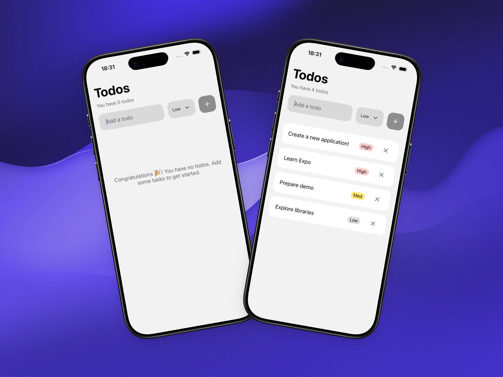

# Simple Todo

A simple todo app built with Expo to learn the basics of React Native. It allows users to add, delete, and mark tasks as completed.



## How to Run

1. Clone the repository:

```bash
git clone https://github.com/alevidals/simple-todo-expo
```

2. Navigate to the project directory:

```bash
cd simple-todo-expo
```

3. Install dependencies:

```bash
pnpm install
```

4. Start the Expo development server:

```bash
pnpm start
```
